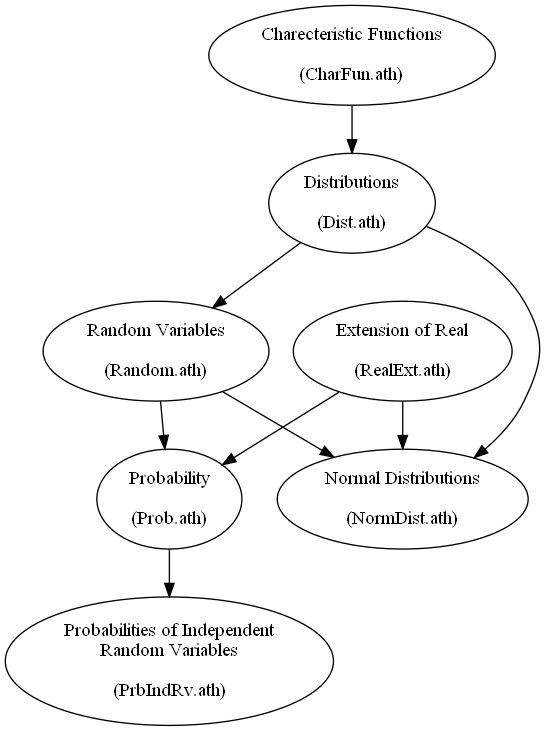

# MATH 

##### This repository contains ATHENA theory and proofs about mathematical concepts like random variables, probability, distributions, etc  

##### Description:

* `RealExt` -Real Extension    
	* `RealExt.ath` : Some extension to Reals 

* `CharFun` - Charecteristic functions    
	* `CharFun.ath` : Basic theory of Charecteristic functions  

* `Dist` - Distributions    
	* `Dist.ath` : Basic theory of distributions    
	* `NormDist.ath` :Theory of Normal Distributions

* `Random` - Random Variables    
	* `Random.ath` : Basic theory of Random Variables

* `Prob` - Probability    
	* `Prob.ath` : Basic theory of Probability    
	* `PrbIndRv.ath` : Probability of Independent random variables

* A rough hierarchy of the files can be seen below (A --> B implies that B is dependent on A)

  

###### Note: This library is under development and many modules may be currently just stubs

##### DISCLAIMER: 
Copyright &copy; 2020 WCL

Permission is hereby granted, free of charge, to any person obtaining a copy
of this software and associated documentation files (the "Software"), to deal
in the Software without restriction, including without limitation the rights
to use, copy, modify, merge, publish, distribute, sublicense, and/or sell
copies of the Software, and to permit persons to whom the Software is
furnished to do so, subject to the following conditions:

The above copyright notice and this permission notice shall be included in all
copies or substantial portions of the Software.

THE SOFTWARE IS PROVIDED "AS IS", WITHOUT WARRANTY OF ANY KIND, EXPRESS OR
IMPLIED, INCLUDING BUT NOT LIMITED TO THE WARRANTIES OF MERCHANTABILITY,
FITNESS FOR A PARTICULAR PURPOSE AND NONINFRINGEMENT. IN NO EVENT SHALL THE
AUTHORS OR COPYRIGHT HOLDERS BE LIABLE FOR ANY CLAIM, DAMAGES OR OTHER
LIABILITY, WHETHER IN AN ACTION OF CONTRACT, TORT OR OTHERWISE, ARISING FROM,
OUT OF OR IN CONNECTION WITH THE SOFTWARE OR THE USE OR OTHER DEALINGS IN THE
SOFTWARE.
#### 
***** THIS IS AN OPEN SOURCE PROJECT! *****

