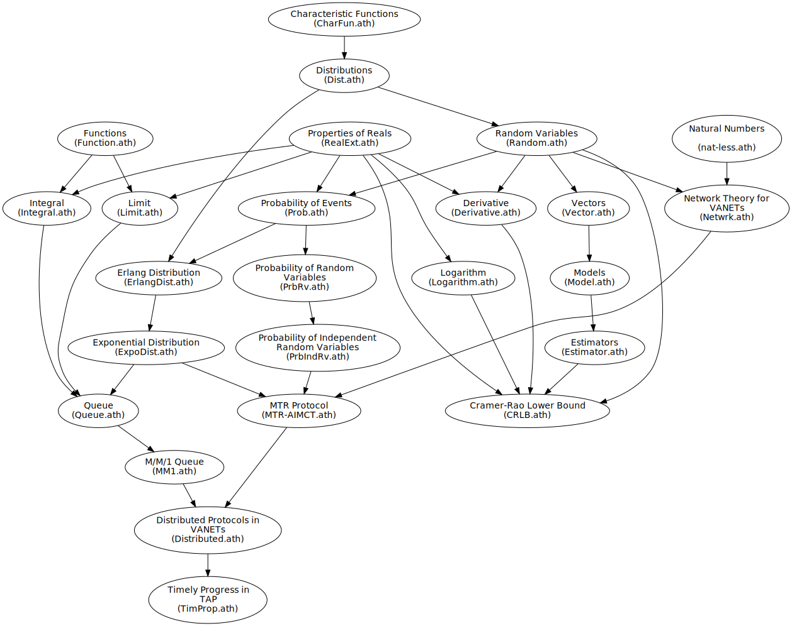

# Athena_LibDDDAS

### This repository contains an extension of the Athena proof library for reasoning about higher-level properties of Dynamic Data-Driven Aerospace Systems

#### Contents:

* `distributed` -- theory and proofs about distributed protocols

* `network` -- theory and proofs about network, relay protocols, etc

* `nmac` -- theory and proofs about an NMAC-aware flight planning algorithm 

* `math` -- theory and proofs about basic mathematical concepts like random variables, probability, distributions, etc  

* `hierarchy_generator` -- python code to generate a hierarchy graph for the library

* A rough hierarchy of the files can be seen below (A --> B implies that B is dependent on A)
    * Note: The hierarchy graph does not include all Athena files in our library   

  

##### Instructions:

1. [Download and install ATHENA](https://proofcentral.org/athena/1.4/) 

2. Place this directory in the `ATHENA_HOME` directory created during installation

3. Rename this directory to `Athena_LibDDDAS` (E.g., `vx.x` will be renamed to `Athena_LibDDDAS`) 

3. Any ATHENA file in the library can then be loaded by issuing the command `.\athena <relative_address_of_file>` from the `ATHENA_HOME` directory

##### ATHENA Resources:

* [ATHENA Website](http://proofcentral.org/)

* [Athena Library](http://proofcentral.org/athena/lib/)

* [ATHENA user's guide](http://proofcentral.org/athena/Athena_User's_Guide.pdf)

* For more about ATHENA, refer to the book [Fundamental Proof Methods in Computer Science](https://mitpress.mit.edu/books/fundamental-proof-methods-computer-science) by Konstantine Arkoudas and David Musser, MIT Press, 2017

###### Note: This library is under development and many modules may be currently just stubs

##### DISCLAIMER: 

Copyright &copy; 2020 WCL

Permission is hereby granted, free of charge, to any person obtaining a copy
of this software and associated documentation files (the "Software"), to deal
in the Software without restriction, including without limitation the rights
to use, copy, modify, merge, publish, distribute, sublicense, and/or sell
copies of the Software, and to permit persons to whom the Software is
furnished to do so, subject to the following conditions:

The above copyright notice and this permission notice shall be included in all
copies or substantial portions of the Software.

THE SOFTWARE IS PROVIDED "AS IS", WITHOUT WARRANTY OF ANY KIND, EXPRESS OR
IMPLIED, INCLUDING BUT NOT LIMITED TO THE WARRANTIES OF MERCHANTABILITY,
FITNESS FOR A PARTICULAR PURPOSE AND NONINFRINGEMENT. IN NO EVENT SHALL THE
AUTHORS OR COPYRIGHT HOLDERS BE LIABLE FOR ANY CLAIM, DAMAGES OR OTHER
LIABILITY, WHETHER IN AN ACTION OF CONTRACT, TORT OR OTHERWISE, ARISING FROM,
OUT OF OR IN CONNECTION WITH THE SOFTWARE OR THE USE OR OTHER DEALINGS IN THE
SOFTWARE.
#### 
***** THIS IS AN OPEN SOURCE PROJECT! *****

